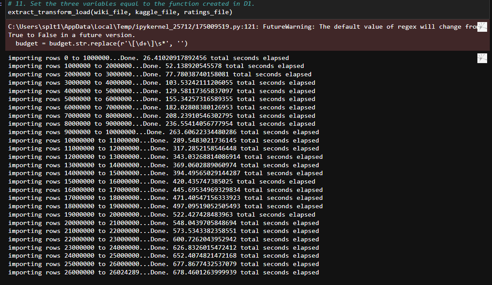

# Movies-ETL

## Overwiev

The folowing project was to design and create an automated pipeline able to take in data, transform it into clean readable and workable data and load it into tables conected to SQL to perform queries. 

Tools and language used: Python, Jupyter Notebook, PostgreSQL with pgAdmin4.
Libraries: Pandas, Numpy, Psycopy2.

## Results

The following code was able to aquire, clean and transform data and send it to SQL and into csv tables that then were exported. 

